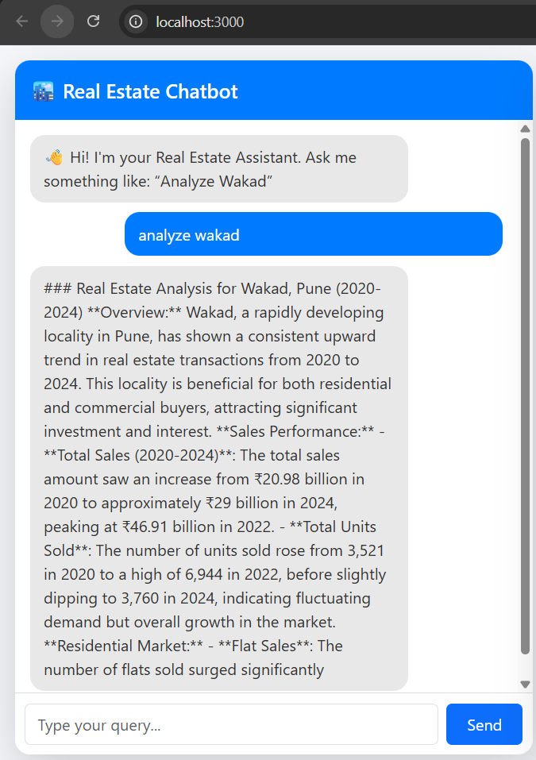
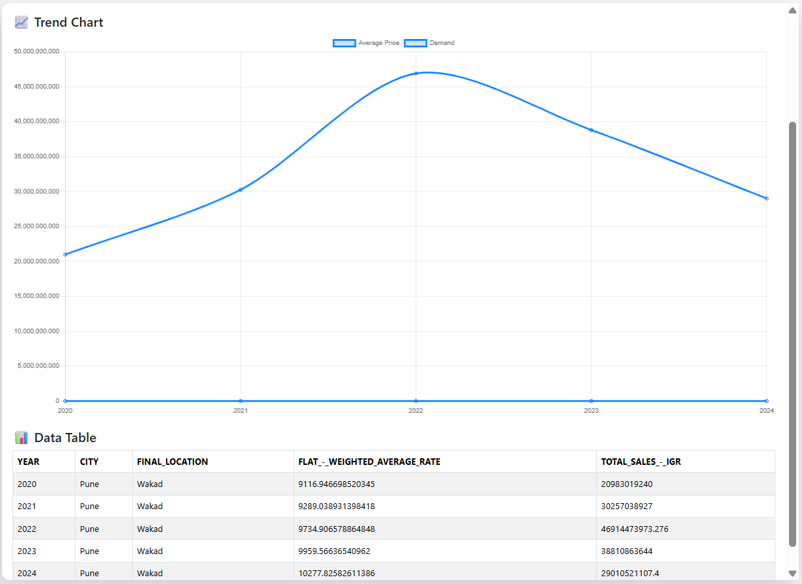

# 🏙️ Real Estate AI Analysis Chatbot (React + Django)

An AI-powered real estate analytics chatbot that allows users to analyze localities, compare areas, and visualize price and demand trends through an interactive chat interface. Built using React and Django with smart query detection, data visualization, and CSV export functionality.

# 🚀 Live Demo

### 🌐 Frontend (Vercel)

https://real-estate-chatbot-sigma.vercel.app

### ⚡ Backend API

https://real-estate-chatbot-5gi5.onrender.com

---

# 📌 Features

## 💬 Smart Chat Interface

- Natural language queries
- Smart query interpretation
- Real-time analysis

## 📊 Data Visualization

- Price trend charts
- Demand trend charts
- Comparison charts

## 🧾 Data Table

- Filtered locality data
- Structured output
- Clean tabular display

## 🧠 Smart Query Detection

Supports:

- Single area analysis
- Compare multiple locations
- Price growth analysis
- Demand trend analysis

---

# ⭐ Bonus Features

✔ OpenAI-powered summaries
✔ CSV download feature
✔ Smart NLP query interpretation
✔ Modern UI animations
✔ Clean modular architecture
✔ Production-ready deployment

---

# 🛠️ Tech Stack

## Frontend

- React.js
- Bootstrap
- Recharts
- Axios

## Backend

- Django
- Django REST Framework
- Pandas
- OpenPyXL
- Python-dotenv
- OpenAI API (Optional)

## Deployment

- Vercel (Frontend)
- Render (Backend)
- GitHub (Version Control)

---

# 📂 Project Structure

```
real-estate-chatbot/
│
├── backend/
│   ├── core/
│   ├── realestate/
│   ├── Sample_data.csv
│   ├── manage.py
│   └── requirements.txt
│
└── frontend/
    ├── src/
    ├── public/
    └── package.json
```

---

# ⚙️ Local Setup Instructions

# 1️⃣ Backend Setup

```bash
cd backend
python -m venv venv
venv\Scripts\activate
pip install -r requirements.txt
```

Create `.env`

```
OPENAI_API_KEY=your_api_key
```

Run Django

```bash
python manage.py runserver
```

Backend runs at:

```
http://127.0.0.1:8000/api/analyze/
```

---

# 2️⃣ Frontend Setup

```bash
cd frontend
npm install
npm start
```

Frontend runs at:

```
http://localhost:3000
```

---

# 📡 API Endpoints

## POST /api/analyze/

Analyze user query

### Example Request

```json
{
  "message": "Analyze Wakad"
}
```

### Response

- Summary
- Chart Data
- Table Data
- Locations
- Query Type

---

## GET /api/download/?area=Wakad

Download filtered dataset as CSV

Example:

```
http://127.0.0.1:8000/api/download/?area=Wakad
```

---

# 💬 Example Queries

Try these:

- "Analyze Wakad"
- "Compare Aundh and Baner"
- "Price growth Hinjewadi"
- "Demand trend Wakad"
- "Compare Wakad vs Baner"

---

# 📊 Screenshots

screenshots/chat.png
screenshots/chart.png
screenshots/table.png

````

```markdown



````

---

# 🎥 Demo Video

Demo Video:

https://drive.google.com/drive/u/1/folders/1WM968B-8KxgKDnT4PZKfe5mwjgRDDNc7

---

# 🚀 Deployment

Frontend:

- Vercel

Backend:

- Render

GitHub:

https://github.com/Aniketm09/real-estate-chatbot

---

# 📈 Project Highlights

✔ Full-Stack React + Django
✔ AI-Powered Chatbot
✔ Real-World Dataset Analysis
✔ Production Deployment

---

# 🧑‍💻 Author

**Aniket Mali**
Full-Stack Developer

🌐 Live Demo:

https://real-estate-chatbot-sigma.vercel.app

📌 GitHub:

https://github.com/Aniketm09

📧 Email:

aniketmali0912@gmail.com
